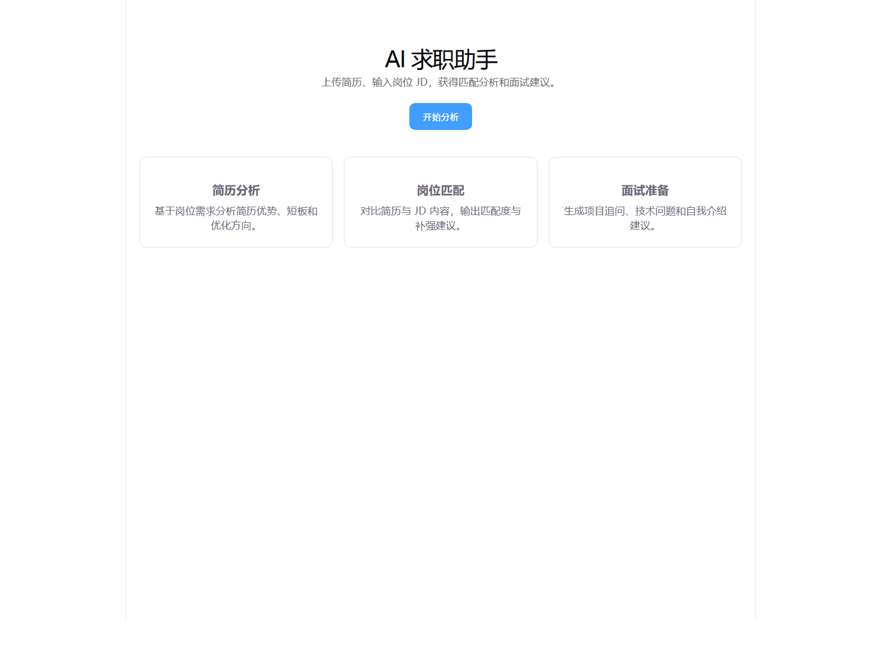
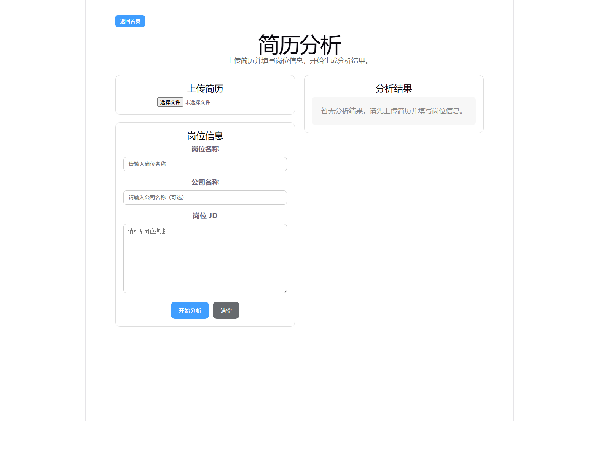
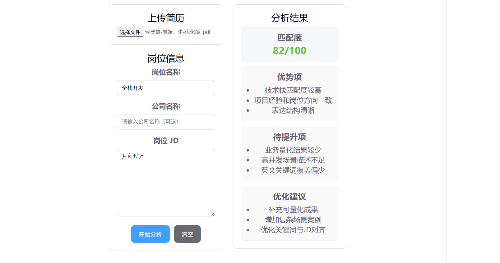
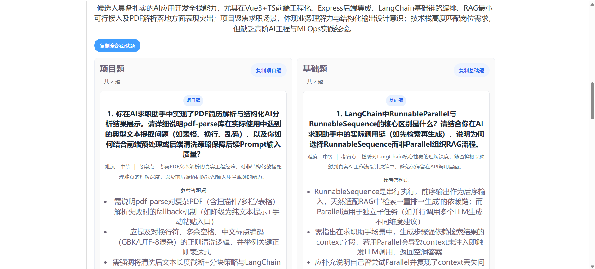

# AI 求职助手

AI 求职助手是一个面向实习求职场景的 AI 应用项目。用户上传 PDF 简历并输入目标岗位 JD 后，系统会解析简历文本，通过 LangChain 结构化分析链路生成岗位匹配分析，并继续提供 RAG 增强面试题生成和 AI 模拟面试聊天能力。

这个项目的重点不是“调用一次 AI 接口”，而是把文件解析、岗位录入、PromptTemplate、结构化输出、RAG 检索增强、结果落库、历史回查、面试题生成和上下文聊天串成一条完整的 AI 求职准备链路。

## 项目价值

很多实习求职者会遇到三个问题：

- 不知道自己的简历和岗位 JD 是否匹配。
- 不知道简历优势、短板和修改方向在哪里。
- 不知道针对当前岗位应该准备哪些面试题。

AI 求职助手围绕这些问题提供一套闭环流程：

```text
上传简历 -> 输入岗位 JD -> LangChain 结构化分析 -> RAG 增强面试题 -> AI 模拟面试聊天
```

## 当前成果

- 已完成 PDF 简历上传与文本解析。
- 已完成岗位名称、公司名称和岗位 JD 录入。
- 已完成 LangChain 简历匹配分析，输出分数、优势、短板和建议。
- 已完成分析结果结构化展示。
- 已完成 `analysisId` 历史分析回查。
- 已完成 RAG 增强分类面试题生成。
- 已完成 AI 模拟面试聊天。
- 已完成聊天会话和聊天消息持久化。
- 已补充基础加载态、空状态、错误提示、超时控制和重试体验。

## 功能演示

### 首页



### 简历分析页



### 登录页


### 分析结果展示



### 分类面试题生成



### AI 模拟面试聊天


## 核心流程

```text
1. 用户上传 PDF 简历
2. 后端解析简历文本并保存 Resume 记录
3. 用户填写目标岗位、公司名称和岗位 JD
4. 后端保存 Job 记录
5. 后端通过 LangChain PromptTemplate 构造分析提示词
6. ChatModel 调用大模型并返回结构化分析结果
7. JsonOutputParser 将 JSON 文本解析成对象
8. zod 校验 score、strengths、weaknesses、suggestions 字段
9. 后端保存 Analysis 记录，前端展示分析结果
10. 用户基于分析结果生成分类面试题
11. 后端根据岗位 JD 和分析结果检索本地面试知识库
12. 将 retrievedKnowledge 拼入 Prompt，生成 RAG 增强面试题
13. 用户进入 AI 模拟面试聊天，围绕当前分析上下文继续追问
```

## AI 链路

### 简历分析链路

```text
JD + 简历文本
-> LangChain PromptTemplate
-> ChatModel
-> JsonOutputParser
-> zod 校验
-> Analysis 结果落库
-> analysisId 回查
```

### 面试题生成链路

```text
analysisId
-> 查询岗位 / 简历 / 分析结果
-> 构造 retrievalQuery
-> 检索本地面试知识库
-> 格式化 retrievedKnowledge
-> 拼入面试题 Prompt
-> 大模型生成分类面试题
```

### 模拟面试聊天链路

```text
analysisId + sessionId
-> 读取岗位 / 简历 / 分析结果 / 历史消息
-> 构造聊天上下文 Prompt
-> 大模型生成追问
-> 保存 ChatMessage
```

## RAG 最小场景

当前面试题生成已接入一个最小 RAG 场景：

```text
岗位名称 + 岗位 JD + 优势项 + 短板项 + 优化建议
-> 构造 retrievalQuery
-> 从本地面试知识库检索相关知识点
-> 将检索结果作为 retrievedKnowledge 加入 Prompt
-> 生成更贴合岗位和项目的分类面试题
```

当前版本使用关键词检索实现最小闭环，后续可以替换为 Embedding + Vector Store：

```text
关键词检索版 retriever
-> Embedding 向量检索
-> topK / chunk size / similarity threshold 调优
-> 召回效果评估
```

## 项目流程图

```text
用户上传 PDF 简历
        ↓
后端解析简历文本
        ↓
用户输入岗位 JD
        ↓
LangChain 结构化分析
        ↓
保存 Analysis 记录
        ↓
生成面试题前检索 RAG 知识库
        ↓
AI 生成分类面试题
        ↓
进入模拟面试聊天
        ↓
保存聊天会话和消息
```

## 技术栈

### 前端

目录：`ai-job-assistant-web`

- Vue 3
- TypeScript
- Vite
- Vue Router
- Axios

### 后端

目录：`ai-job-assistant-server`

- Node.js
- Express 5
- TypeScript
- Prisma
- SQLite
- Multer
- pdf-parse
- mammoth
- Axios

### AI 能力

- 大模型接口调用。
- LangChain PromptTemplate / ChatModel / JsonOutputParser 链路。
- zod 结构化字段校验。
- JSON 结构化输出约束与解析兜底。
- timeout / retry / fallback 稳定性处理。
- RAG 增强面试题生成。
- 基于岗位、简历、分析结果和历史消息进行模拟面试聊天。

## 项目结构

```text
ai-job-assistant
|-- ai-job-assistant-web                 # 前端 Vue 应用
|-- ai-job-assistant-server              # 后端 Express 服务
|   |-- src/langchain                    # LangChain 分析链路
|   |-- src/rag                          # RAG 知识库与检索器
|   |-- src/routes                       # 后端路由
|   `-- src/services                     # 业务服务封装
|-- docs                                 # 项目文档与截图
`-- README.md
```

## 核心页面

- `/`：首页入口。
- `/analysis`：简历上传、岗位信息填写、简历分析、面试题生成。
- `/analysis?analysisId=xxx`：按分析 ID 回显历史分析结果。
- `/chat?analysisId=xxx`：进入 AI 模拟面试聊天。
- `/chat?analysisId=xxx&sessionId=xxx`：继续指定聊天会话。

## 后端接口

基础接口：

- `GET /api/ping`：服务健康检查。
- `GET /api/hello`：连通性测试。

简历与岗位：

- `POST /api/resume/upload`：上传并解析简历文件，返回 `resumeId`。
- `POST /api/job/create`：创建岗位信息，返回 `jobId`。

分析：

- `POST /api/analysis/run`：根据 `jobId` 和 `resumeId` 执行 LangChain 结构化分析。
- `GET /api/analysis/:analysisId`：读取分析详情。

面试题：

- `POST /api/interview/generate`：根据 `analysisId` 生成 RAG 增强分类面试题。

聊天：

- `POST /api/chat/session`：创建聊天会话。
- `GET /api/chat/session/:sessionId`：读取聊天会话和消息列表。
- `POST /api/chat/send`：发送用户消息并生成 AI 面试官回复。
- `DELETE /api/chat/session/:sessionId`：清空指定聊天会话。

## 数据模型

当前使用 Prisma + SQLite，核心表包括：

- `resumes`：保存简历文件名和解析后的文本。
- `jobs`：保存岗位名称、公司名称和 JD。
- `analyses`：保存匹配分数、优势、待提升项、建议和 AI 原始输出。
- `ChatSession`：保存某次分析下的聊天会话。
- `ChatMessage`：保存聊天消息、角色、顺序和创建时间。

## 项目亮点

- LangChain 结构化分析链路：使用 PromptTemplate、ChatModel、JsonOutputParser 和 zod 校验完成 JD + 简历的结构化匹配分析。
- RAG 增强面试题生成：生成面试题前，根据岗位 JD 和分析结果检索本地面试知识库，将检索内容作为上下文加入 Prompt。
- AI 输出稳定性：通过 Prompt 约束、Parser、zod 校验、timeout、retry 和 fallback 提升 AI 输出稳定性。
- 历史回查与会话持久化：支持 analysisId 回查分析结果，并保存模拟面试聊天记录。
- 数据持久化：使用 Prisma + SQLite 保存简历、岗位、分析结果、聊天会话和聊天消息。
- 前后端职责清晰：前端负责交互和展示，后端负责文件解析、AI 调用、数据存储和异常处理。
- 可继续扩展：当前 RAG 为关键词检索最小闭环，后续可以升级为 Embedding + Vector Store。

## 本地运行

### 环境要求

- Node.js 20+
- npm
- 大模型 API Key

### 启动后端

```bash
cd ai-job-assistant-server
npm install
npm run dev
```

创建 `ai-job-assistant-server/.env`，可参考 `.env.example`：

```env
DASHSCOPE_API_KEY=your_dashscope_api_key_here
PORT=3000
DATABASE_URL="file:./dev.db"
AI_TIMEOUT_MS=30000
```

后端默认地址：

```text
http://localhost:3000
```

### 启动前端

```bash
cd ai-job-assistant-web
npm install
npm run dev
```

前端默认地址：

```text
http://localhost:5173
```

## 构建与检查

前端构建：

```bash
cd ai-job-assistant-web
npm run build
```

后端类型检查：

```bash
cd ai-job-assistant-server
npm run typecheck
```

后端构建：

```bash
cd ai-job-assistant-server
npm run build
```

## 推荐测试流程

1. 打开 `http://localhost:5173/analysis`。
2. 上传 PDF 简历。
3. 填写岗位名称、公司名称和 JD。
4. 点击“开始分析”，确认页面展示匹配度、优势项、待提升项和优化建议。
5. 刷新 `/analysis?analysisId=xxx`，确认历史分析结果可以回查。
6. 点击“生成面试题”，确认 RAG 增强分类面试题正常展示。
7. 点击“开始模拟面试”，进入聊天页。
8. 输入回答并发送，确认 AI 面试官能基于当前分析结果继续追问。
9. 刷新聊天页，确认聊天记录可以恢复。
10. 关闭后端或断网测试错误态，确认页面能展示错误信息和重试按钮。

## 面试可讲点

这个项目不是简单调 API，而是一个完整的 AI 应用闭环。后端先解析 PDF 简历，再结合岗位 JD 通过 LangChain PromptTemplate、ChatModel、JsonOutputParser 和 zod 校验生成结构化分析结果，并把结果落库。生成面试题时，后端会根据岗位 JD 和分析结果检索本地面试知识库，把检索结果作为 retrievedKnowledge 加入 Prompt，实现最小 RAG 增强。前端负责把分数、优势、短板、建议、面试题和聊天内容产品化展示，并支持 analysisId 回查和聊天记录持久化。

## 后续规划

- 将当前关键词检索版 RAG 升级为 Embedding + Vector Store。
- 增加面试题生成结果持久化，刷新后可恢复题目。
- 优化 AI 输出异常兜底、接口超时和错误提示。
- 增加历史分析列表页，提升产品完整度。
- 补充演示视频和部署地址。

## 注意事项

- AI 能力依赖有效的大模型 API Key，未配置时分析、面试题和聊天接口会失败。
- 聊天功能依赖有效的 `analysisId`，需要先完成一次简历分析。
- 当前项目主要面向本地开发和学习演示，尚未实现完整登录、权限隔离和生产级鉴权。
- SQLite 数据库适合本地开发，生产环境建议切换到更稳定的数据库方案。
